# Readme Auto Language Poll
## fetches and builds language poll for GitHub

### Demo:

<div align="center">
    
</div>

## Usage

1)  Install the dependencies.

    ```
    npm install
    ```
2)  Add a ".env" file to the project root directory.

    ```
    touch .env
    echo GHUB_PERSONAL_ACCESS_TOKEN=<your github token> >> .env
    echo LANGUAGE_COUNT=<total top language you want. default:5> >> .env
    echo DECIMAL_PRECISION=<decimal precision for percentages. default:1> >> .env
    ```
    P.S. `LANGUAGE_COUNT` and `DECIMAL_PRECISION` is optional.
3)  Run the script.

    ```
    npm start
    ```


This line inside `/assets/templates/markdown.mustache` links the svg to the readme.md.
you can edit this template, to customize the readme like adding a name and stuff, just keep this line intact to add your GitHub language poll.


## Tech-stack


- Node.js and TypeScript - To develop the core script
- mustache - For building the markdown templates
- octokit - For GitHub APIs.
- axios - To fetch the language colors. see [here](https://raw.githubusercontent.com/github/linguist/master/lib/linguist/languages.yml).


### Thanks for checking out